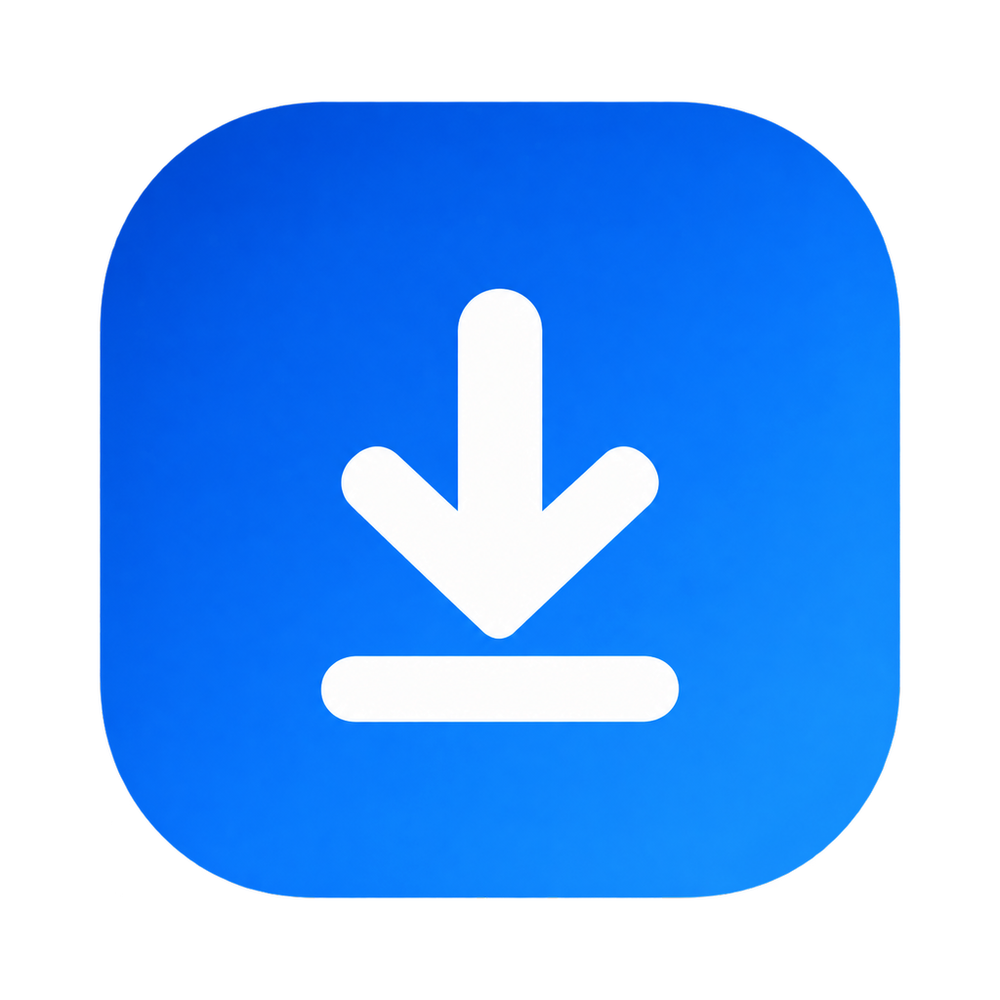
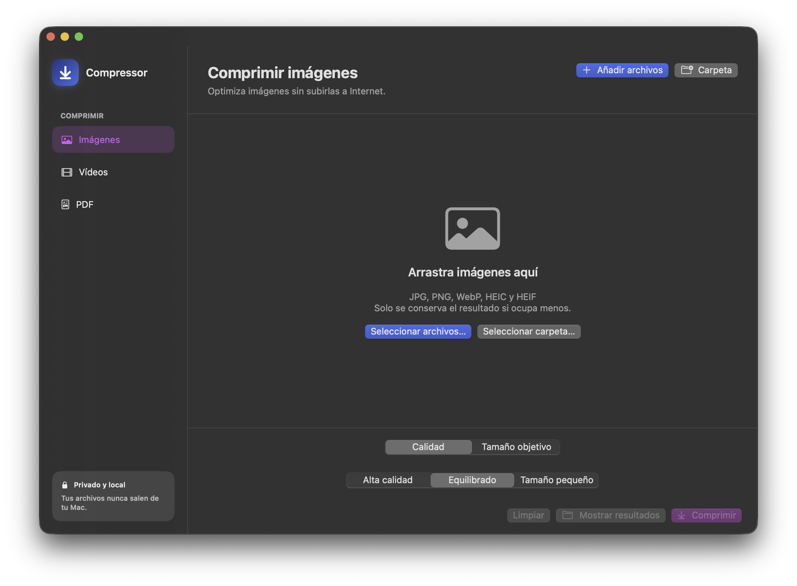

<div align="center">

  <p>
    <b>Español</b> | <a href="README.en.md">English</a>
  </p>

  

  # Compressor para macOS
  
  **El compresor nativo definitivo de Imágenes, Vídeo y PDF para tu Mac.**  
  *Local · Aceleración por Hardware · Sin dependencias externas · Privacidad absoluta*

  [](https://github.com/infoprojectstone/compressor)
  [](https://swift.org)
  [](https://github.com/infoprojectstone/compressor)
  [](LICENSE)
  [](https://ko-fi.com/infofprojectstone)
  [](https://infoprojectstone.github.io/compressor/)

  <br />

  <a href="https://github.com/infoprojectstone/compressor/releases">
    
  </a>
  <a href="https://ko-fi.com/infofprojectstone">
    
  </a>
  <a href="https://infoprojectstone.github.io/compressor/">
    
  </a>

  <br /><br />

  

</div>

<br />

## ✨ Características Principales

* ⏱️ **Diseñado para Ahorrar Tiempo:** Sin colas de subida en la nube ni interfaces confusas. Arrastra archivos, elige el peso que necesitas y comprime en segundos.
* 🔒 **Local y Seguro:** Tus fotografías personales, vídeos confidenciales y documentos nunca tocan la nube ni servidores de terceros. Cero telemetría y sin requerir conexión a internet.
* ⚡ **Aceleración por GPU:** Codificación nativa de vídeo y procesamiento gráfico ultra-rápido mediante `AVFoundation`, `CoreGraphics` e `ImageIO`, optimizado para chips Apple Silicon.
* 🛡️ **Garantía Anti-Pérdida:** Los archivos originales nunca se sobrescriben. Y si una compresión no consigue reducir el peso del archivo, el sistema lo descarta automáticamente avisándote con el estado *"Sin mejora"*.
* 📁 **Integración con Finder:** Comprime archivos o carpetas enteras con un solo clic derecho desde el menú contextual de Finder sin necesidad de abrir la aplicación previamente.
* 🎯 **Doble Modo de Operación:**
  * **Modo Calidad:** Elige entre *Alta calidad*, *Equilibrado* o *Tamaño pequeño*.
  * **Modo Tamaño Objetivo:** Define el peso máximo exacto deseado en megabytes (MB) (ideal para correos, WhatsApp o plataformas con límites estrictos de subida).

---

## 🗂️ Los Tres Motores en Detalle

### 📸 1. Imágenes
* **Formatos soportados:** JPG, PNG, WebP, HEIC (fotos del iPhone) y HEIF.
* **Preservación inteligente:** Mantiene la transparencia alfa y perfiles de color originales.
* **Ahorro típico:** De un **-60% a un -95%** sin pérdida visual apreciable.

### 🎬 2. Vídeo
* **Formatos soportados:** MP4, MOV y M4V.
* **Tecnología:** Pipeline nativo con `AVAssetReader` + `AVAssetWriter` con control de bitrate adaptativo en dos pasadas y audio estéreo AAC de alta definición.
* **Resoluciones:** Auto (máx. 1080p), 720p, 540p o resolución original.
* **Ahorro típico:** De un **-50% a un -85%**.

### 📄 3. Documentos PDF (`SafePDFCompressor`)
* **Nuevo motor híbrido en dos niveles nativos:**
  * **Nivel 1 (Vectorial con `QuartzFilter`):** Optimiza y recompime las fotos e imágenes embebidas, **preservando toda la nitidez de tipografías, hipervínculos y texto seleccionable**.
  * **Nivel 2 (Rasterización Adaptativa Inteligente):** Diseñado específicamente para documentos escaneados (páginas que son imágenes puras). Calcula el presupuesto de bytes por página para garantizar que el archivo final sea siempre más ligero que el original.
* **Ahorro típico:** De un **-50% a un -95%**.

---

## 🖱️ Integración con Finder (Acción Rápida)

Puedes comprimir cualquier archivo o carpeta directamente desde Finder:

1. Abre **Ajustes** dentro de Compressor (`Cmd` + `,`).
2. Ve al apartado **Integración con Finder** y pulsa en **"Instalar Acción Rápida"**.
3. Haz clic derecho sobre cualquier imagen, vídeo o PDF en Finder y selecciona:
   * **Acciones rápidas > Comprimir con Compresor** (o desde el menú de Servicios).
   * La aplicación se abrirá instantáneamente, cambiará a la pestaña correcta y encolará los archivos seleccionados para procesarlos.

---

## 🚀 Instalación y Seguridad (Gatekeeper)

Al tratarse de una aplicación independiente de código abierto distribuida sin certificado de pago corporativo de Apple Developer:

1. Descarga [`Compressor-1.2.dmg`](https://github.com/infoprojectstone/compressor/releases) y ábrelo.
2. Arrastra **Compressor** a la carpeta **Aplicaciones**.
3. La primera vez que abras la app, si macOS muestra el aviso *"no se puede abrir porque Apple no puede comprobar si contiene software malicioso"*:
   * Haz **clic derecho** (o `Control` + clic) sobre Compressor en la carpeta Aplicaciones y pulsa en **Abrir**.
   * O bien ve a **Ajustes del Sistema > Privacidad y seguridad** y haz clic en **"Abrir igualmente"**.

---

## 🛠️ Compilación y Desarrollo

Requisitos: macOS 13.0 o superior, Xcode Command Line Tools (`xcode-select --install`).

* **Ejecutar la suite completa de pruebas:**
  ```bash
  zsh scripts/run-tests.sh
  ```

* **Compilar la aplicación en Release y generar el .ZIP:**
  ```bash
  zsh scripts/build-app.sh
  ```

* **Generar el instalador DMG:**
  ```bash
  zsh scripts/create-dmg.sh
  ```

---

## ☕ Apoya el Proyecto

Compressor es una herramienta independiente y gratuita. Si la aplicación te ha **ahorrado tiempo** o te ha sacado de un apuro con un archivo pesado, puedes apoyar su desarrollo y mantenimiento continuo invitándome a un café:

👉 **[Invítame a un café en Ko-fi (ko-fi.com/infofprojectstone)](https://ko-fi.com/infofprojectstone)**
